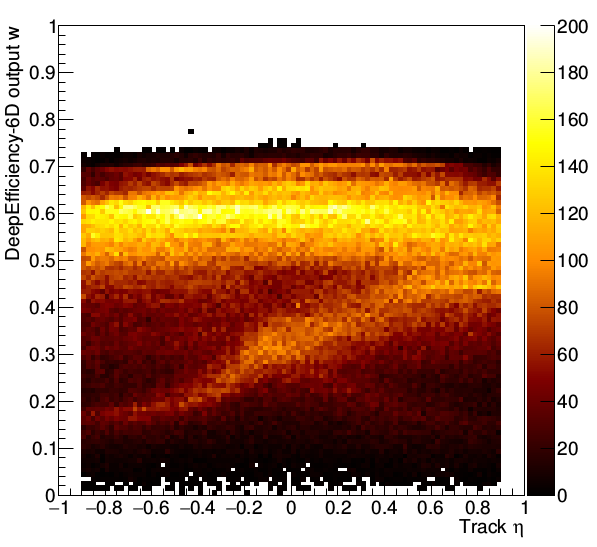

# DeepEfficiency
https://arxiv.org/abs/1809.06101

Invited talk at IRN Terascale, Annecy, France, 2019 </br>
https://indico.in2p3.fr/event/18701/contributions/72003/

[](https://opensource.org/licenses/MIT)



**Requirements: Python3 & Tensorflow 1.8+ & ROOT libraries**
</br>
</br>
*This is a research level proof-of-principle code. Depending on the physics application, additional algorithms, estimators and regularization techniques may be needed.*
</br>

### Get ascii (.csv) out from ROOT trees
```
root printascii.c+ -b -q
```

### Train DeepEfficiency networks
```
train.sh
```

### Obtain efficiency inversion estimates
```
predict.sh
```

### Plot differential distributions
```
make && ./deeplot
```
</br>

## Reference

If you use this work in your research, please cite the paper:

```
@article{mieskolainen2018deepefficiency,
    title={DeepEfficiency - optimal efficiency inversion in higher dimensions at the LHC},
    author={Mikael Mieskolainen},
    year={2018},
    journal={arXiv:1809.06101},
    eprint={1809.06101},
    archivePrefix={arXiv},
    primaryClass={physics.data-an}
}
```
